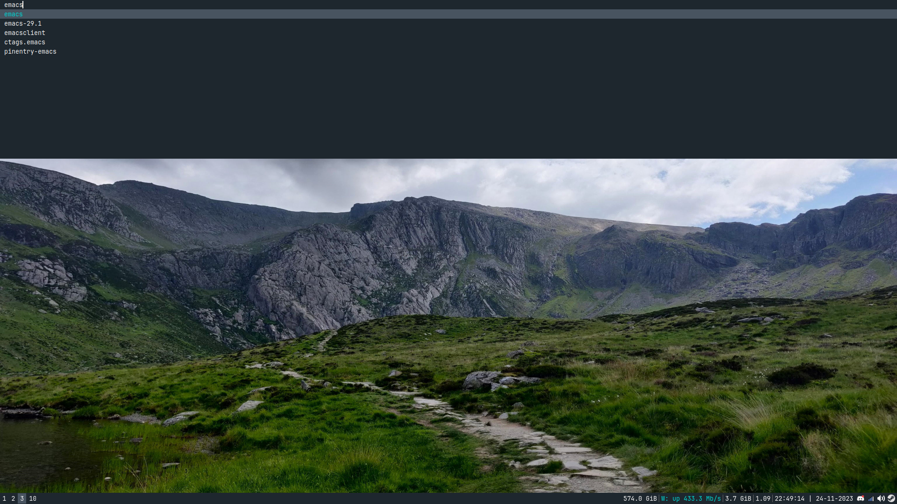

# justinac0-dmenu
My personal fork of dmenu (https://tools.suckless.org/dmenu/). My system color
palette is based off flatui swedish palette (https://flatuicolors.com/palette/se).

# IMPORTANT
Only for X11 based wm.

# Installation
1. Remove dmenu through your package manager if it's already installed.
2. clone this repo.
3. Run ```make all install```

# Showcase

